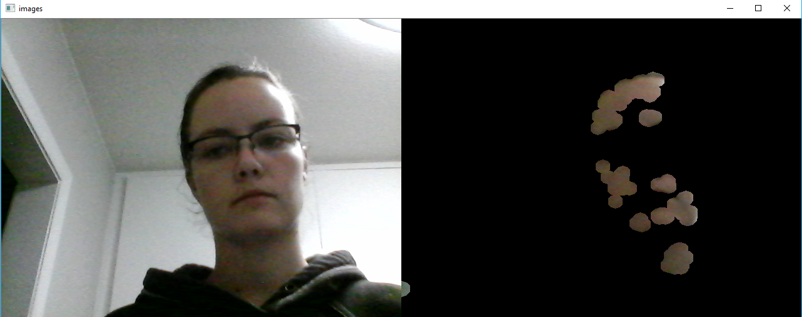
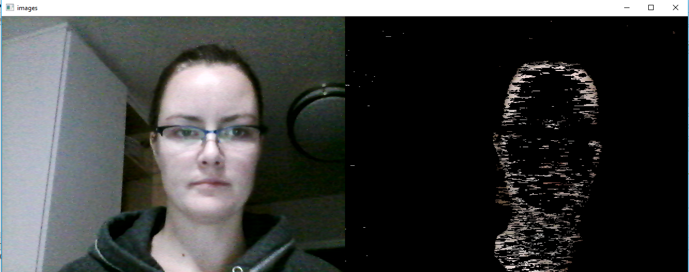

# SkinDetection

Skin Detection takes a set range of HSV values to detect skin in the webcam video. HSV is used instead of RGB since it is more immune to illumination changes. Worked okay sometimes, however, for different skin colors then my own (anything outside the HSV range), skin was no longer detected. Therefore, I created the skinDetectionBetter.py which takes in RGB skin colors and uses this to train a classifier. This better detects various ranges of skin color. I use a Gaussian Naive Bayes algorithm to train and test the classifier.

Usuage:   python skinDetection.py

          python skinDetectionBetter.py
          

